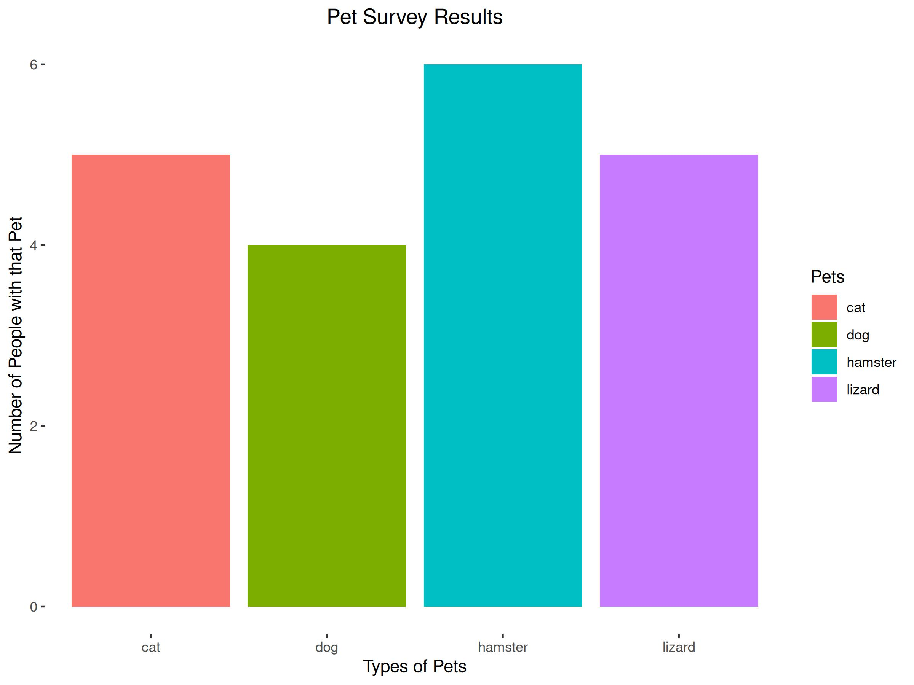

# Pets!

This repository serves not only as an example of many of the great features GitHub has to offer but also as a fun tool to visualize a survey of pets.

To try this out for yourself follow the steps below:
1. Make a copy of this repository on your own GitHub account by using the "Fork" button (above the green "Code" button) and following the instructions.
2. Give workflows in your new repository permission to both read and write by:
   * Navigating to **Settings>Actions>General**
   * Scroll down to **Workflow permissions**
   * Ensure that **Read and write permissions** is selected and save if needed (This may already be your default)
3. Open the workflow in the **.github/workflows** folder and edit lines 40 and 41 with your GitHub username and e-mail then commit your changes
4. Edit the **Data.csv** file with your own collected pet data
5. Go to the **Actions** tab, select the **Data Visualizer** workflow, and run the workflow from the dropdown to the right
6. Wait for the workflow to run (1-2 minutes)
7. Refresh repository and open the **Pet_Data_Viz.jpg** file to see your new visualization!
8. If your image is in your README file like below, that version may take some time to update after the file is changed (sometimes as long as 10 minutes)

# Data Visualization

